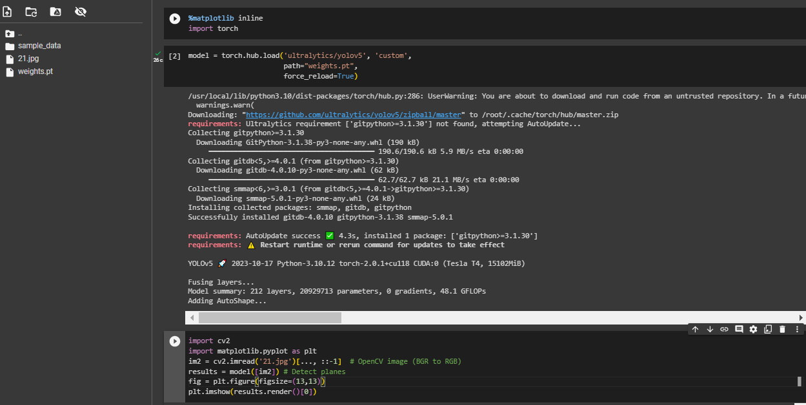

# MilAcraft-Recognition
Military aircraft recognition task

Important: All notebooks were running on the google colab, so in order
to run jupyter notebooks from this repo please clone them into colab.

If you want to train/inference model using your machine, please follow the guides below

Project requirements:
Python - 3.9

Project structure:

    \ documentation folder:
        \ \ Object Recognition and classification task # Document that describes solution of the task 
    \ EDA folder:
        \ \ Exploratory data analysis.ipynb # Jupyter notebook with EDA
    \ jupyter drafts:
        \ \ Jupyter drafts for selecting input size of images
    \ models evaluation:
        \ \ YOLO_BaseLine_evaluation.ipynb # Evaliation of the first baseline model
        \ \ v2 eval # Folder with evaluation notebook of the second model
        \ \ v3 eval # Folder with evaluation notebook of the third model
    \ models train:
        \ \ MODEL 01 YOLO Baseline.... # Folder with notebook and weights of training first YOLO model
        \ \ MODEL 02 YOLO v2 # Folder with notebook and weights of training second YOLO
        \ \ MODEL 03 YOLO v3 # Folder with notebook and weights of training third YOLO
    \ yolov5: Cloned repo of yolov5 model for local training
    \ get_dataset.py # Python script for getting dataset
    \ local_utils.py # Utilities 
    \ weights.py # Weights of best model

## Training model locally ( platform tested - windows)

1) Open get_dataset file. In it, on lines 32 and 33 specify your api parameters to access kaggle
2) Start command line interface in repository foler
3) Create python venv:
   
        python -m venv venv
4) Activate virtual env

        venv\Scripts\activate

5) Install requirements

         pip install -r requirements.txt

6) Run get dataset file

         python get_dataset.py

7) Run YOLO training with command line interface

         python yolov5/train.py --img 800 --batch 24 --epochs 75 --data dataset.yml --name 'mar results' --patience 50 --weights yolov5m.pt --hyp hyps.yml

## Model inference

1) Start new google colab file
2) Upload weights.pt file to your notebook
3) Load model with torch hab

        model = torch.hub.load('ultralytics/yolov5', 'custom',
                       path=MODEL_WEIGHTS,
                       force_reload=True)  # or yolov5n - yolov5x6 or custom
   
4) Set %matplotlib inline function
5) Use the model. In order to detect something on image

    a) Upload image in google colab
   
    b) In your notebook write:
                
            im2 = cv2.imread('21.jpg')[..., ::-1]  # OpenCV image (BGR to RGB)
            results = model([im2]) # Detect planes
            fig = plt.figure(figsize=(13,13))
            plt.imshow(results.render()[0])

Inference example:
